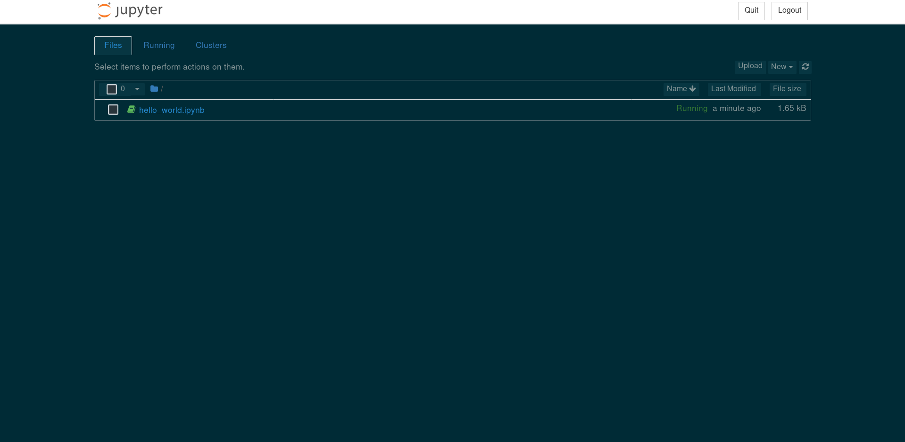
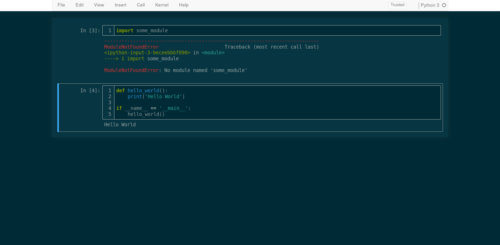
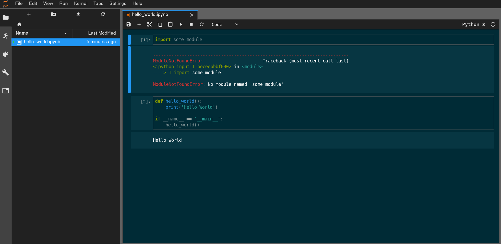

# jupyter-notebook-solarized-dark
Solarized dark theme for Jupyter Notebook

## Preview

### JupyterLab notebook cells

## Installation
You can Install [Stylus](https://add0n.com/stylus.html) for either Firefox, Chrome or Opera and then [install the usercss](https://raw.githubusercontent.com/YoogottamK/jupyter-notebook-solarized-dark/master/jupyter-notebook-solarized-dark.user.css).

## Notes
This assumes that you are running jupyter notebook on the default `localhost:8888`. If you have changed the port for some reason, you can update it in the script. Also, if you run something else at that port, you might see some weird styles.

## Issues
Please create issues on GitHub. Please include screenshots and how to reproduce them.

## Contribute
This is in no way complete/perfect. Help is appreciated. If you want to contribute, you can fork this repo and create pull requests.
